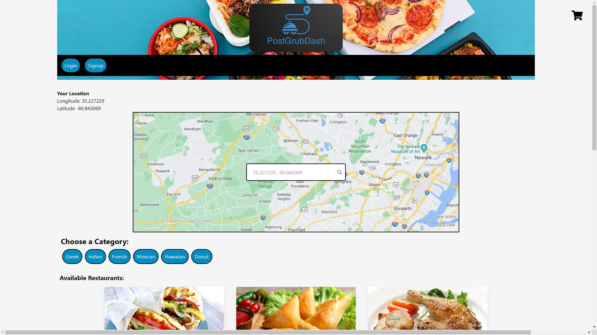
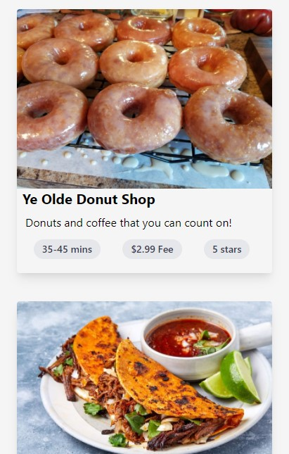

# PostGrubDash


[Deployed Site](https://postgrubdash.herokuapp.com/)

## Description
PostGrubDash is a food delivery application that shows nearby restaurants and allows the user to select menu items to be delivered.

## Table of Contents
  - [Installation](#installation)
  - [Usage](#usage)
  - [Resources](#resources)
  - [Contributors](#contributors)
  - [Screenshots](#screenshots)
  - [License](#license)

## Installation 
In order to run this program locally you will need to:
1. Clone this repository to receive all the files.
2. Run ```npm install``` in the terminal to download all the needed dependencies (make sure you are in the correct file directory).

## Usage
1. Run ```npm run develop``` in the terminal to start the program.

## Resources
- [Tailwind CSS](https://tailwindcss.com/docs)
- [Apollo GraphQL](https://www.apollographql.com/docs/)
- [MongoDB](https://docs.mongodb.com/)
- [Google Geolocation API](https://developers.google.com/maps/documentation/geolocation/overview)
- [Stripe API](https://stripe.com/docs/api)

## Contributors
 - [huirayj](https://github.com/huirayj)
 - [b00000001](https://github.com/b00000001)
 - [aaron-might](https://github.com/aaron-might)
 - [Sand-ito](https://github.com/Sand-ito)
 - [nzerr57](https://github.com/nzerr57)

## Screenshots
### Desktop Screenshot

### Mobile Screenshot 


## License
[](https://opensource.org/licenses/MIT)
